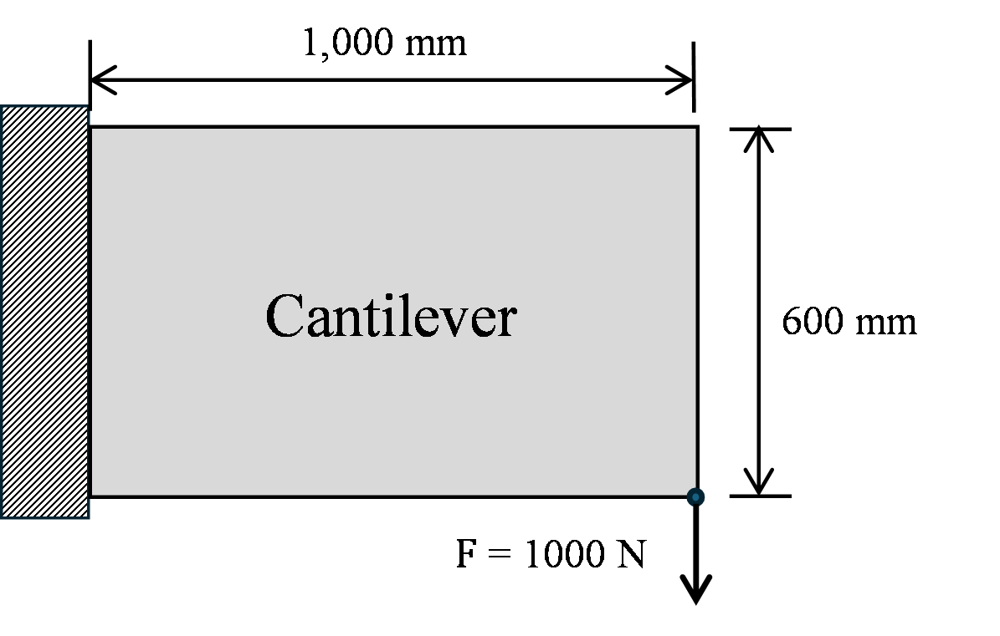
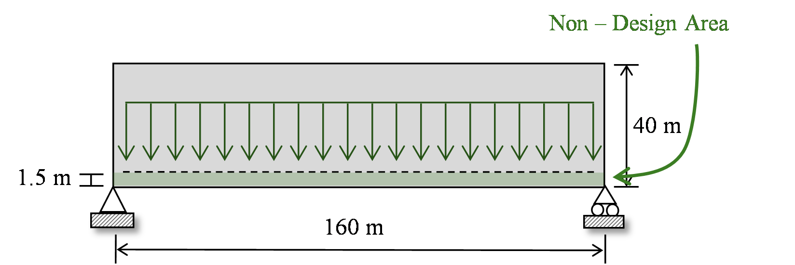
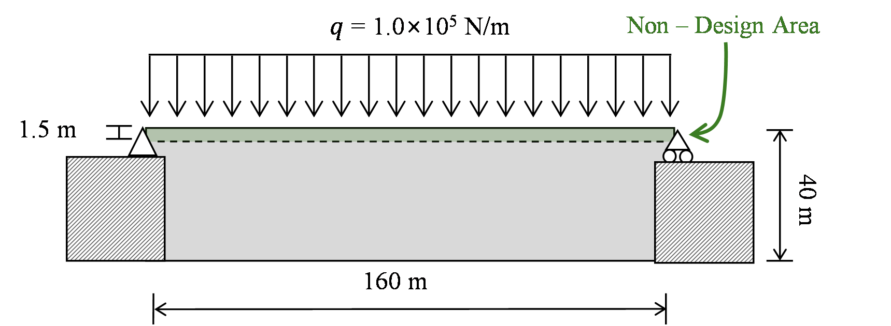

# Example Boundary Conditions

The public package contains three primary reproducibility examples. The
coordinates below follow the finite-element and plotting convention used in
the scripts: node row 1 is at `y = 0`, and element row 1 is the top row. Row
numbers and `y` increase downward in the displayed two-dimensional domain.

The schematics show the continuum-level problem definitions. The numbered
node rows and masks listed below, and ultimately the example scripts, are the
authoritative discrete definitions. The green area labelled "Non-Design Area"
in the bridge schematics is implemented as retained solid through
`fixed_solid_mask`; it is not the forced-void `non_design_mask` option.

## Cantilever

- Mesh: `100 x 60` Q4 elements over `1000 x 600 mm`.
- Thickness: `1 mm`.
- Support: all degrees of freedom on the left edge.
- Load: one downward `1000 N` nodal force at the right-end corner shown in the
  schematic. In the compact implementation this is the final vertical degree
  of freedom, `F(2 * (nelx + 1) * (nely + 1))`.
- Target solid fraction: `0.4`.
- Self-weight: not included.

## Case III(a): lower retained deck

- Mesh: `320 x 80` Q4 elements over `160 x 40 m`.
- Thickness: `1 m`.
- Retained-solid deck: element rows `78:80`, a `1.5 m` bottom band.
- Supports: left endpoint restrained in x and y and right endpoint restrained
  in y, both on node row 81 (`y = 40 m`).
- Deck load: `q = 1e5 N/m`, distributed equally over all 321 nodes on node row
  78 (`y = 38.5 m`), the upper surface of the retained deck; total external
  load `16 MN`.
- Self-weight: included from the current material layout.

## Case III(b): upper retained deck

- Mesh: `320 x 80` Q4 elements over `160 x 40 m`.
- Thickness: `1 m`.
- Retained-solid deck: element rows `1:3`, a `1.5 m` top band.
- Supports: left endpoint restrained in x and y and right endpoint restrained
  in y, both on node row 1 (`y = 0 m`).
- Deck load: `q = 1e5 N/m`, distributed equally over all 321 nodes on node row
  1, along the upper deck; total external load `16 MN`.
- Self-weight: included from the current material layout.

The equal-node rule preserves the total line load but differs slightly from a
consistent Q4 edge-load vector, which assigns half force to the two end nodes.
Select the rule with `deck_load_distribution`.

The example scripts are the authoritative definitions of mesh indices, load
rows, supports, and retained masks. Where a continuum load symbol spans a deck
in a schematic, the documented node row states its exact discrete location.
