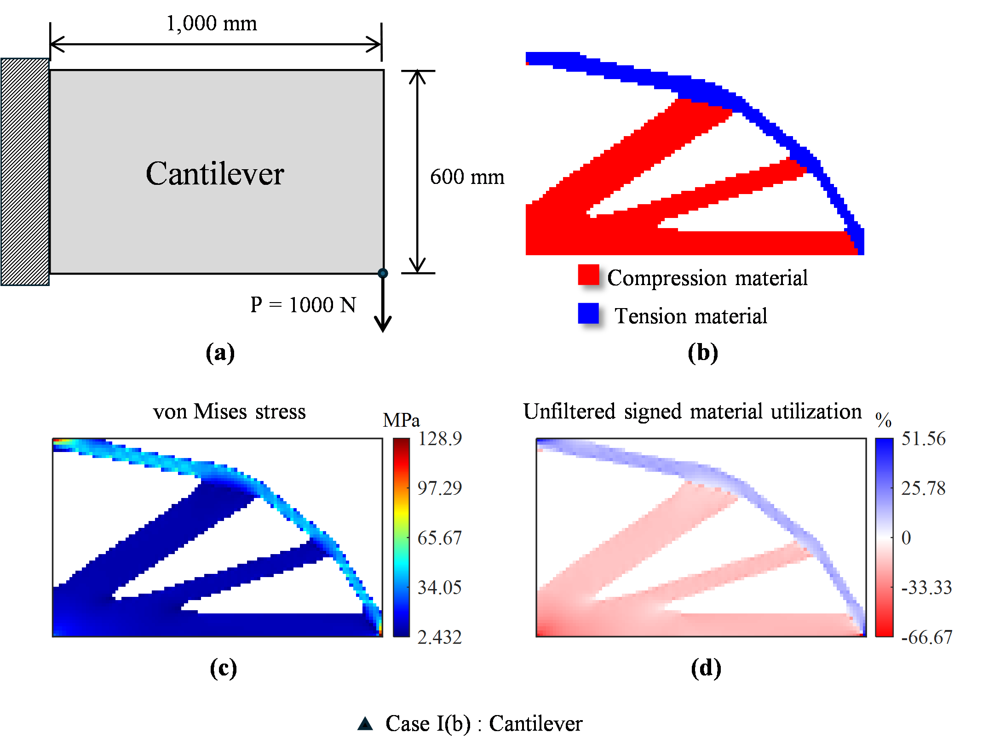
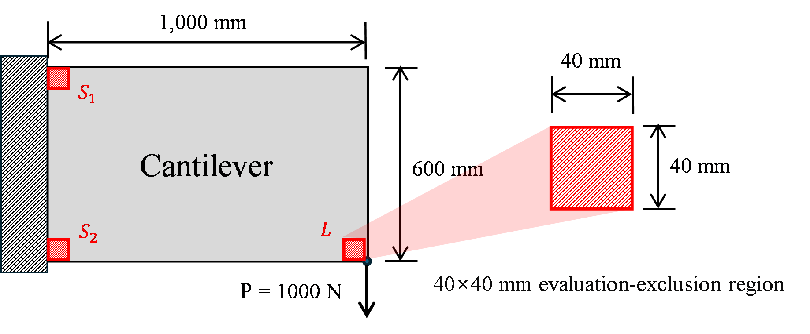
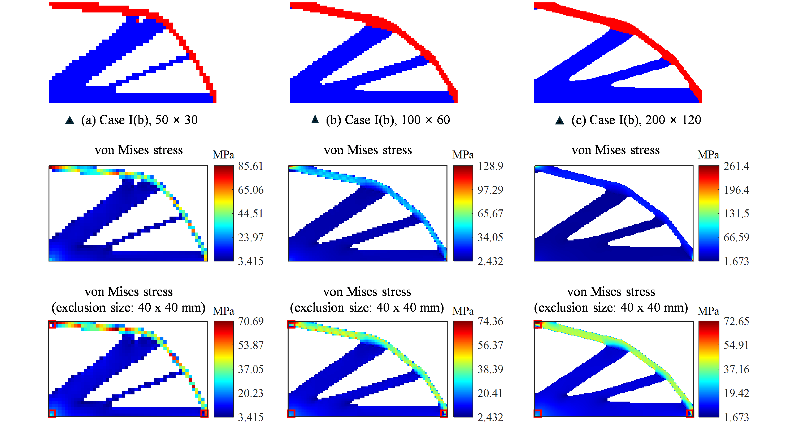
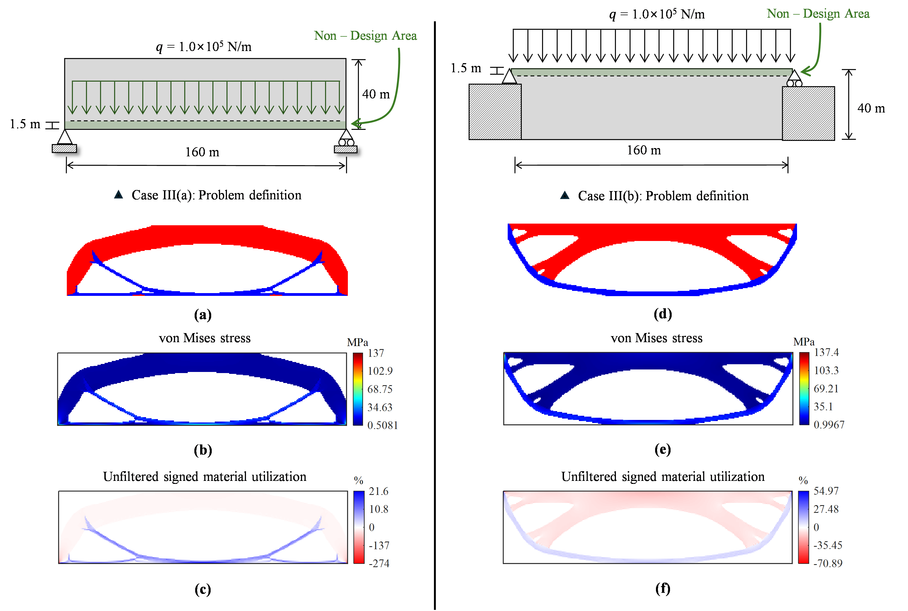
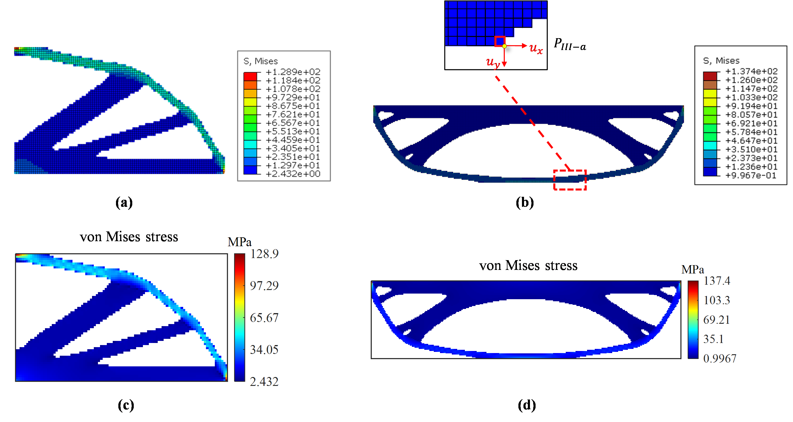

# MBESO2D Validation Summary

This directory contains the compact numerical evidence for the MBESO2D
version 1.0.0 manuscript and release. Large MAT files, Abaqus databases, full
iteration logs, and manuscript-editing assets are intentionally not tracked.

## Scope

The release validation addresses four questions:

1. Do the three public examples reproduce their frozen release baselines?
2. How do the Case I(b) full-domain results compare with Li and Xie (2021)?
3. Are the cantilever topology and nonsingular stress response consistent
   across three mesh resolutions when fixed 40 x 40 mm regions are omitted
   only from extrema evaluation?
4. Do matched fixed-layout finite-element responses agree with Abaqus?

Stress-exclusion post-processing is used only for the Section 3.2 mesh study.
The primary cantilever and bridge benchmarks report full-domain responses. The
bridge benchmarks use an out-of-plane thickness of 1 m; a 1 mm bridge-thickness
study is not part of the final manuscript or release validation.

## Files

| File | Purpose |
| --- | --- |
| `run_all_validation.m` | Run release regression and, optionally, the longer mesh study. |
| `run_regression_checks.m` | Execute all three public examples and compare topology, objective, and full-domain response values with `reference_results.csv`. |
| `run_mesh_independence.m` | Reproduce the fixed-iteration `50 x 30`, `100 x 60`, and `200 x 120` mesh study. |
| `compute_excluded_extrema.m` | Evaluate extrema outside a physical post-processing patch; the manuscript calls it with 40 mm for the cantilever mesh study. |
| `reference_results.csv` | Exact release baseline for the three public examples. |
| `cantilever_literature_comparison.csv` | Values and differences discussed for Case I(b) in manuscript Section 3.1. |
| `mesh_independence_reference.csv` | Rounded values reported in manuscript Table 5. |
| `bridge_benchmark_reference.csv` | Full-domain 1 m bridge values reported in manuscript Table 6. |
| `abaqus_crosscheck.csv` | Matched fixed-layout values reported in manuscript Table 7. |

## Reproduction

Run the release regression from the repository root:

```matlab
setup_mbeso_path
addpath('validation')
validation = run_all_validation(false);
```

The three-resolution mesh study is longer:

```matlab
validation = run_all_validation(true);
```

The primary examples can also be run individually:

```matlab
run('examples/run_cantilever.m')
run('examples/run_case_3a.m')
run('examples/run_case_3b.m')
```

## Reference environment

- MATLAB R2024b Update 7
- Windows 64-bit
- Base MATLAB only
- Double-precision sparse finite-element solution

Case names follow Li and Xie (2021): Case III(a) is the lower retained deck and
Case III(b) is the upper retained deck.

## Representative figures

The tracked PNG files were generated from the same final result data used by
the manuscript examples. They provide visual context; the CSV tables and
executable checks are the numerical authority.

### Cantilever benchmark



This manuscript figure combines the problem definition, final material layout,
full-domain von Mises stress, and full-domain unfiltered signed material
utilization used in Section 3.1. No load or support patch is omitted from the
reported extrema.

### Mesh-resolution study



The three red squares define fixed physical `40 x 40 mm` evaluation-exclusion
regions. `S1` and `S2` surround the two fixed corners on the left boundary, and
`L` surrounds the point-load corner on the lower-right boundary. The same
physical size is represented by `2 x 2`, `4 x 4`, and `8 x 8` element patches
for the `50 x 30`, `100 x 60`, and `200 x 120` meshes, respectively.



The top row shows the final material layouts, the middle row shows the
full-domain von Mises fields, and the bottom row shows the same stress fields
with the displayed extrema and color limits evaluated outside the fixed
`40 x 40 mm` regions. The red outlines identify those regions. Their elements
remain in the finite-element analysis and optimization, and their stress values
are neither deleted nor modified.

### Bridge benchmarks



This manuscript figure combines the problem definitions, final material
layouts, full-domain von Mises stresses, and full-domain unfiltered signed
material utilization fields for both bridges. Both cases use a 1 m
out-of-plane thickness. No bridge stress-exclusion values are used in the final
manuscript.

## Release regression

| Example | Mesh | Iterations | Compliance (N mm) | M1 / M2 elements | Max VM (MPa) | Signed utilization, tension / compression (%) |
| --- | ---: | ---: | ---: | ---: | ---: | ---: |
| Cantilever | 100 x 60 | 214 | 574.783605811 | 549 / 1851 | 128.9075 | 51.563 / -66.667 |
| Case III(a), lower deck, 1 m | 320 x 80 | 95 | 2552153826.2 | 1884 / 8356 | 136.9925 | 21.596 / -273.985 |
| Case III(b), upper deck, 1 m | 320 x 80 | 93 | 1675156216.16 | 2318 / 7922 | 137.4143 | 54.966 / -70.894 |

For the reference MATLAB release, the regression requires convergence status,
iteration count, and material counts to match exactly. Compliance and response
extrema use a relative tolerance of `1e-8`. Sparse-solver ordering on another
platform can alter ties and the discrete layout; report any observed deviation
instead of silently replacing the baseline. The objective reported as
compliance is `0.5 * U' * K * U`.

## Case I(b) literature comparison

`cantilever_literature_comparison.csv` records the values used in manuscript
Table 4 and the associated absolute and relative differences. The compliance
difference is 6.41%, while local full-domain stress and utilization extrema
show larger differences. The comparison is indicative rather than a strict
code-to-code regression because the reference publication does not fully
specify stress recovery, averaging, filtering, tie handling, or the precise
objective evaluation procedure.

## Mesh-resolution study

`mesh_independence_reference.csv` records the three discretizations and the
full-domain and 40 x 40 mm singularity-excluded von Mises maxima reported in
manuscript Table 5. The fixed physical dimension corresponds to `2 x 2`,
`4 x 4`, and `8 x 8` element patches for the three meshes. Only extrema
evaluation changes; no element or stress value is removed from the analysis.

For an arbitrary requested dimension, `compute_excluded_extrema.m` rounds the
width up to a complete element layer and reports the represented size.

## Bridge benchmarks

`bridge_benchmark_reference.csv` contains only the final 1 m Case III(a) and
Case III(b) benchmarks. It records the unrounded release responses underlying
the rounded values in manuscript Table 6. The primary example scripts are the
authoritative definitions of deck position, load row, support conditions,
self-weight, and retained-solid masks.

## Abaqus comparison



The figure compares Abaqus centroidal von Mises stresses with the corresponding
MBESO2D element-centroid stresses for Case I(b) and Case III(b). The inset marks
the selected Case III(b) node and displacement directions used in the numerical
comparison. Mesh, material layout, loads, boundary conditions, and
out-of-plane thickness are matched between the two analyses.

`abaqus_crosscheck.csv` records the final manuscript fixed-layout comparison:
centroidal von Mises stress, selected nodal displacements, and compliance for
Case I(b) and Case III(b). These values verify the finite-element response under
matched conditions; they do not independently validate the topology-update
algorithm. The Abaqus exporter and large solver files are outside this compact
release, so the CSV is documentary evidence rather than an executable Abaqus
regression.

## Evidence policy

- CSV files are the compact numerical evidence kept under version control.
- Representative PNG files show the final manuscript scope; editable figure
  sources and large result files remain outside the release.
- A baseline changes only after an intentional numerical modification is
  documented in `CHANGELOG.md`.
- Raw MAT files, Abaqus databases, exported jobs, and intermediate figures
  belong under ignored `validation/private/` or `validation/raw/` directories.

Unfiltered signed material utilization uses the sign of the unfiltered
principal-stress sum. Material reassignment uses the separately filtered
stress-state field stored in `response.sigma_e_filtered`.
